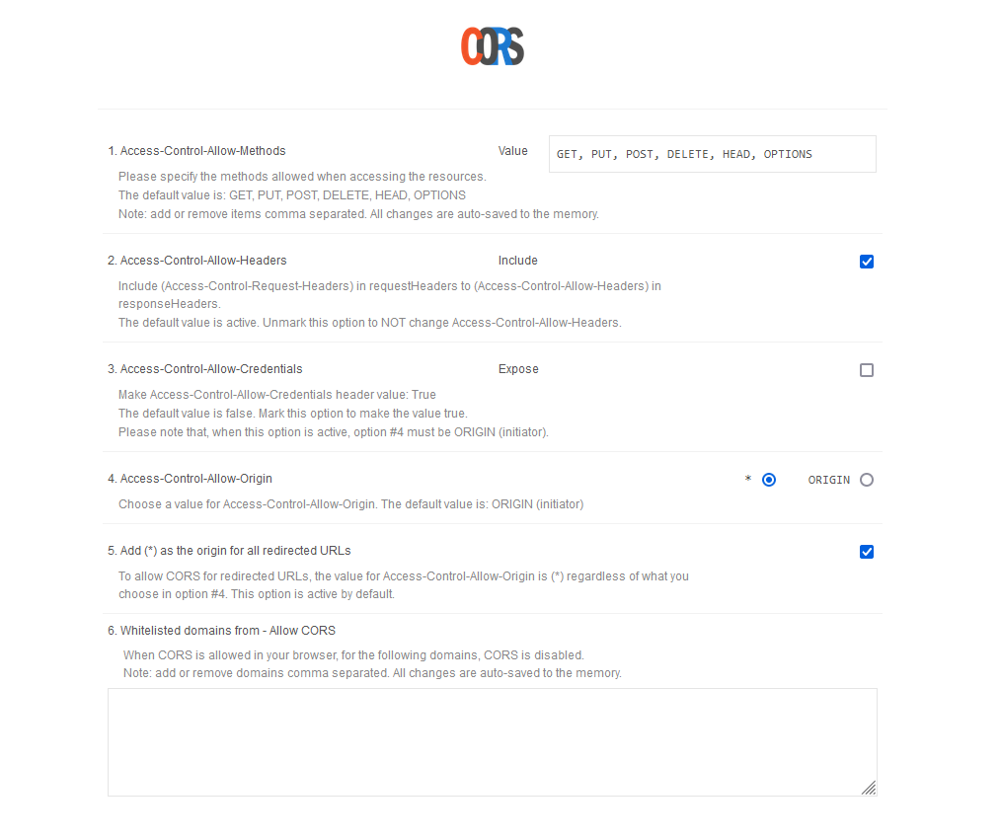

# Note sull'esecuzione

## JSON Mocks

Il servizio di JSON hosting fornito nelle specifiche sembra non essere piu' disponibile.

La scelta effettuata e' stata utilizzare postman-echo.com.

Tale servizio, tra le altre cose, puo' ricevere una richiesta POST con dei dati che vengono inseriti nell'oggetto JSON di risposta alla chiave `data`.

Pertanto, troverete il mock definito nella funzione handleSubmit e inviato in una richiesta POST a `postman-echo.com/post` per essere consumato emulando una vera richiesta ad un back-end.

### CORS

Tuttavia, `postman-echo.com` forza delle regole per la gestione delle sorgenti della richiesta e l'applicazione potrebbe fallire ad effettuare le fetch a causa di questo.

Pertanto si consiglia di installare e abilitare una estensione nel proprio per disattivare questi controlli:

- Firefox: https://addons.mozilla.org/it/firefox/addon/access-control-allow-origin/
- Chrome: https://chromewebstore.google.com/detail/allow-cors-access-control/lhobafahddgcelffkeicbaginigeejlf?pli=1

1. Impostare l'estensione come nello screenshot di seguito
2. abilitarla nella pagina localhost:3000
3. aggiornare la pagina



- Access Allow Control Headers: `Abilitato`
- Access Control Allow Origin: `*`

In uno scenario reale che utilizza un vero backend ed esegue il deployment dell'applicazione in maniera opportuna, questo problema non verrebbe percepito. Pertanto quanto in questo paragrafo e' da considerare ai fini dello sviluppo dell'esempio specifico, che non include un back-end. Infatti, nessuna delle scelte di programmazione ha impatto su questa operazione, se non l'utilizzo di quel server che non disabilita questi controlli, così come altri già provati.

## Run

Per eseguire l'applicazione:

```
npm install
npm start
```

# Versioning

Poiche' si richiede la non pubblicazione di questo progetto, la consegna non e' effettuata via GIT, ma attraverso un file archivio allegato per mail.

Le directory .git e node_modules sono escluse. Si tenga conto delle operazioni necessarie per l'esecuzione. Il codice e la sua esecuzione e' stata testata su Windows 11.
